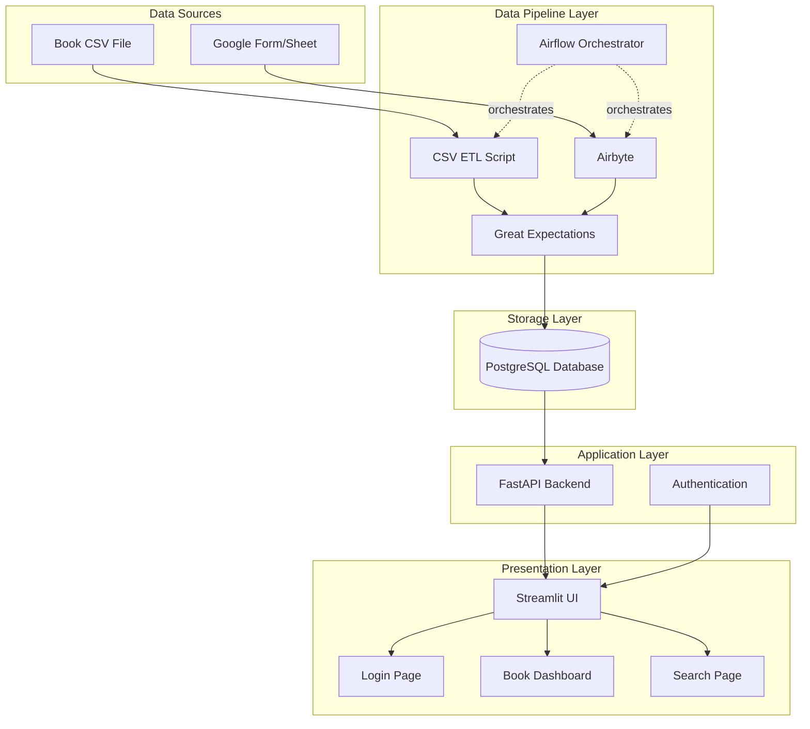

# School Library Management System

A comprehensive, Dockerized book management system designed for schools. It features a modern Streamlit UI, a robust FastAPI backend, PostgreSQL database, and automated ETL pipelines orchestrated by Apache Airflow.

## 🚀 Key Features

- **📚 Inventory Management**: Track books, categories, and storage locations.
- **👥 Teacher Management**: Manage borrowers and track their activity.
- **🔄 Automated Pipelines**: 
  - Bulk import books via CSV.
  - Auto-sync transactions from Google Sheets.
- **🔍 Smart Search**: Instantly find books by ID (e.g., "A-018") or title.
- **📊 Dashboard**: Real-time visualization of library status (Available, On Loan, Lost).
- **🔐 Secure Access**: JWT-based authentication for administrators.
- **🐳 Fully Containerized**: One-command deployment with Docker Compose.

---

## 🏗 Architecture

The system follows a microservices architecture:

| Service | Technology | Description |
|---------|------------|-------------|
| **Frontend** | Streamlit | User interface for books management |
| **Backend** | FastAPI | REST API handling logic & auth |
| **Database** | PostgreSQL | Primary data storage |
| **ETL** | Python/Pandas | Data processing scripts |
| **Orchestrator** | Airflow | Schedules and monitors pipelines |




---

## 🛠 Prerequisites

- **Docker Desktop**: Ensure it's installed and running.
- **Git**: For cloning the repository.

---

## ⚡️ Quick Start Guide

### 1. Clone the Repository
```bash
git clone <repository-url>
cd library_system
```

### 2. Configure Environment
Copy the example environment file:
```bash
cp .env.example .env
```
*Note: The default `.env` is pre-configured for local development. For production, update the passwords!*

### 3. Start All Services
Run the following command to build and start the system:
- Multi-container setup with Docker Compose
- Services: PostgreSQL, FastAPI, Streamlit, Airflow, ETL
- Separate Dockerfiles for each service
- Health checks and dependencies configured

```bash
docker-compose up -d --build
```
*This may take a few minutes the first time as it builds the Docker images.*

### 4. Verify Installation
Check if all containers are running:
```bash
docker-compose ps
```
You should see `library_backend`, `library_frontend`, `library_postgres`, `airflow_webserver`, and `airflow_scheduler` in `Up` or `Healthy` state.

### Project Structure
```
library_system/
├── backend/          # FastAPI REST API
├── frontend/         # Streamlit UI
├── database/         # PostgreSQL setup
├── etl/              # Data pipelines
├── airflow/          # Orchestration
├── airbyte/          # Data integration
├── data/             # CSV files
├── credentials/      # API credentials
└── tests/            # Test suite
```

### Useful Commands

**View Logs**
```bash
docker-compose logs -f backend    # Backend logs
docker-compose logs -f frontend   # Frontend logs
docker-compose logs -f airflow-scheduler # Airflow logs
```

**Restart a Service**
```bash
docker-compose restart frontend
```

**Reset Database** (⚠️ Destructive!)
```bash
docker-compose down -v # Remove all containers, networks, and volumes
docker-compose up -d
```

### Troubleshooting Tips
- **Port Conflicts**: If port `5433` or `8080` is in use, modify `docker-compose.yml` to map to a different host port.
- **Database Connection**: If the backend fails to connect, ensure the `postgres` container is `Healthy`.
- **Airflow DAGs Missing**: It may take a minute for Airflow to parse new DAGs. Check the scheduler logs if they don't appear.

