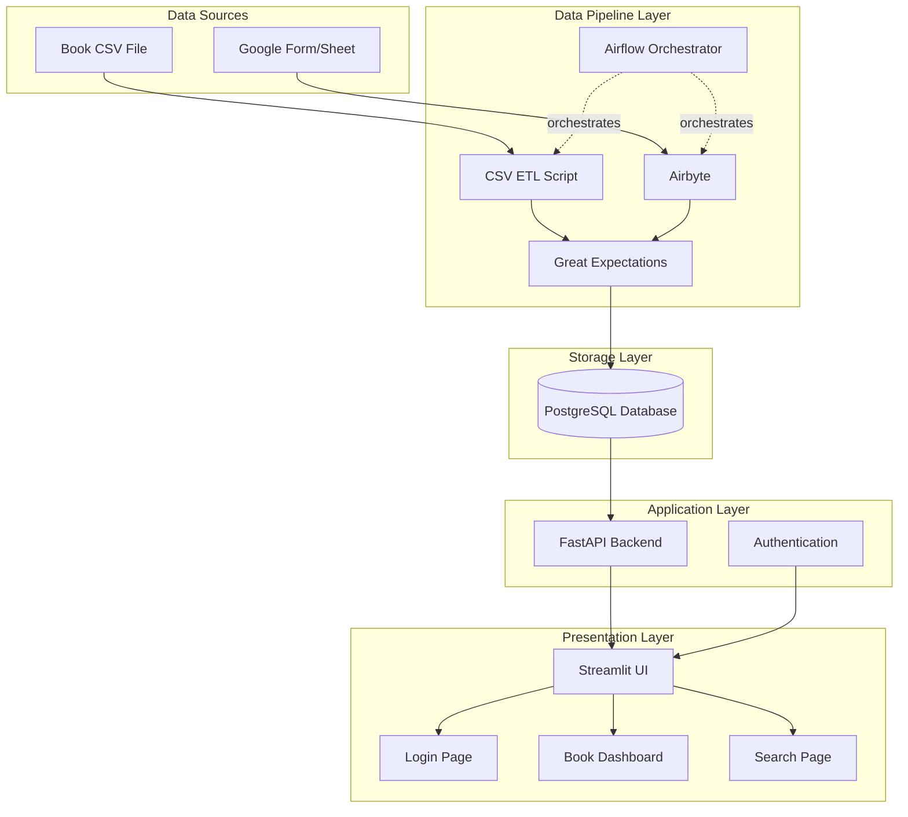
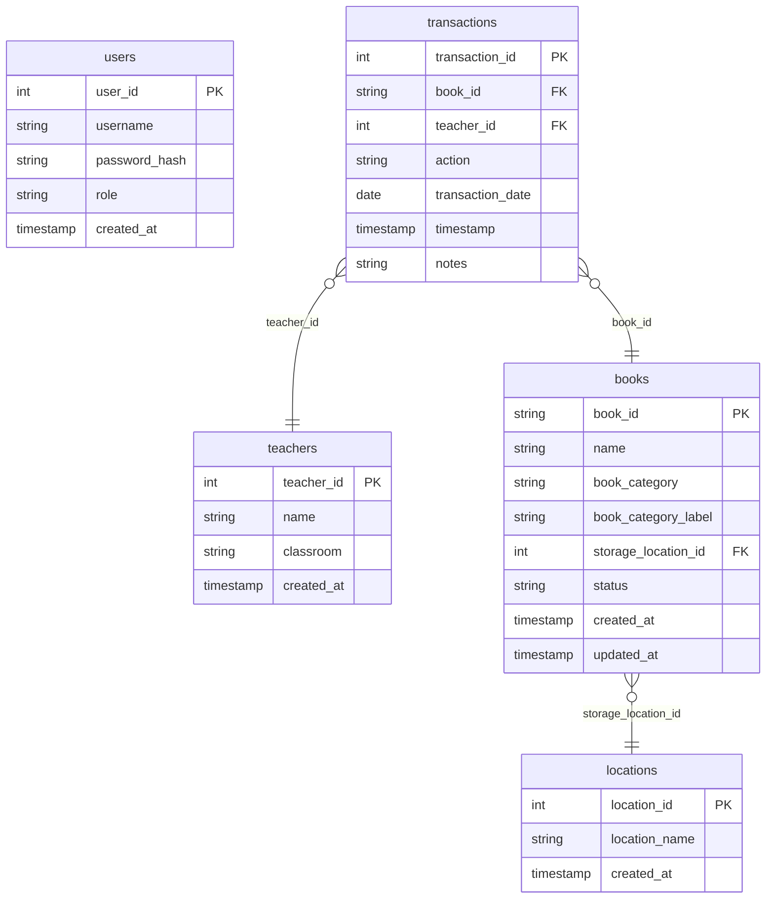

# School Library Management System

A comprehensive, Dockerized book management system designed for schools. It features a modern Streamlit UI, a robust FastAPI backend, PostgreSQL database, and automated ETL pipelines orchestrated by Apache Airflow.

## 🚀 Key Data Engineering Concepts

This project demonstrates a complete end-to-end data engineering solution:

*   **ETL Pipelines**: Automated extraction, transformation, and loading of data from multiple sources (CSV, Google Sheets).
*   **Data Orchestration**: Uses **Apache Airflow** to schedule and monitor data workflows.
*   **Data Quality**: Integrated **Great Expectations** for data validation and quality checks.
*   **Data Integration**: Utilizes **Airbyte** for syncing data from external sources (Google Sheets).
*   **Data Modeling**: Normalized **PostgreSQL** schema designed for integrity and performance.
*   **Containerization**: Fully containerized environment using **Docker** and **Docker Compose**.

---

## 🏗 Architecture

The system follows a microservices architecture, separating concerns between data processing, storage, backend logic, and frontend presentation.



---

## 🛠 Technology Stack

### Core Infrastructure
- **Containerization**: Docker & Docker Compose
- **Database**: PostgreSQL 15+
- **Migration Tool**: Alembic

### Data Pipeline
- **ETL Framework**: Python (Pandas, SQLAlchemy)
- **Data Integration**: Airbyte (for Google Sheets)
- **Orchestration**: Apache Airflow
- **Data Quality**: Great Expectations

### Application Layer
- **Backend API**: FastAPI (REST API)
- **Frontend**: Streamlit
- **Authentication**: JWT tokens with bcrypt
- **ORM**: SQLAlchemy

---

## 💾 Database Design

The database schema is designed to ensure data integrity and efficient querying.

### Entity Relationship Diagram



### Schema Overview

*   **`books`**: Central inventory table.
*   **`transactions`**: Records all borrow/return events.
*   **`teachers`**: Stores borrower information.
*   **`locations`**: Storage locations for books.
*   **`users`**: Stores authentication details for system administrators.

#### Key Tables

**Table: `books`**
```sql
CREATE TABLE books (
    book_id VARCHAR(50) PRIMARY KEY,
    name VARCHAR(255) NOT NULL,
    book_category VARCHAR(50) NOT NULL,
    book_category_label VARCHAR(50) NOT NULL,
    storage_location_id INTEGER,
    status VARCHAR(20) DEFAULT 'Available',
    created_at TIMESTAMP DEFAULT CURRENT_TIMESTAMP,
    updated_at TIMESTAMP DEFAULT CURRENT_TIMESTAMP,
    FOREIGN KEY (storage_location_id) REFERENCES locations(location_id),
    CHECK (status IN ('Available', 'On Loan', 'Lost', 'Archived'))
);
```

**Table: `transactions`**
```sql
CREATE TABLE transactions (
    transaction_id SERIAL PRIMARY KEY,
    book_id VARCHAR(50) NOT NULL,
    teacher_id INTEGER NOT NULL,
    action VARCHAR(10) NOT NULL,
    transaction_date DATE NOT NULL,
    timestamp TIMESTAMP DEFAULT CURRENT_TIMESTAMP,
    notes TEXT,
    FOREIGN KEY (book_id) REFERENCES books(book_id),
    FOREIGN KEY (teacher_id) REFERENCES teachers(teacher_id),
    CHECK (action IN ('borrow', 'return'))
);
```

---

## 🔄 ETL Pipeline Strategy

The system employs two main pipelines to handle data ingestion and synchronization.

### Pipeline 1: CSV Book Data Import
**Purpose**: Initial and periodic bulk loading of book inventory.

**Process**:
1.  **Extract**: Read CSV file (columns: `category_name`, `category_label`, `book_name`, `location`).
2.  **Transform**:
    *   Validate required fields.
    *   Normalize category and location names.
    *   Generate book IDs.
3.  **Load**: Upsert categories/locations and insert books.
4.  **Quality Checks**: Great Expectations validations.

### Pipeline 2: Google Sheets Transaction Sync
**Purpose**: Continuous sync of borrow/return transactions from a Google Form.

**Data Entry Strategy**:
To ensure data quality at the source, the Google Form uses a structured input method:
1.  **Category Dropdown**: Fixed list (e.g., A, B, C).
2.  **Manual Label Input**: Numeric portion (e.g., "018").
3.  **Transformation**: The pipeline combines these to form the `book_id` (e.g., "A-018").

**Process**:
1.  **Extract**: Airbyte pulls data from Google Sheets.
2.  **Transform**:
    *   Construct `book_id`.
    *   Fuzzy match teacher names.
    *   **Deduplication**: Keep latest record per book based on timestamp.
3.  **Load**: Insert transactions and update book status.
4.  **Sync Strategy**: Incremental sync every 15-30 minutes via Airflow.

---

## 📂 Project Structure

```
library_system/
├── backend/                 # FastAPI application
│   ├── app/
│   │   ├── main.py         # FastAPI entry point
│   │   ├── models/         # SQLAlchemy models
│   │   └── routers/        # API endpoints
├── frontend/                # Streamlit application
│   ├── app.py              # Main Streamlit app
│   └── pages/              # Multi-page app
├── database/                # Database setup
│   ├── init/               # Initialization scripts
│   └── migrations/         # Alembic migrations
├── etl/                     # Data pipeline
│   ├── csv_loader/
│   ├── google_sheets/
│   └── great_expectations/
├── airflow/                 # Orchestration
│   └── dags/
└── airbyte/                 # Data integration
```

---

## ⚡️ Quick Start Guide

### 1. Prerequisites
*   Docker Desktop installed and running.
*   Git.

### 2. Installation
```bash
# Clone the repository
git clone <repository-url>
cd library_system

# Configure Environment
cp .env.example .env
# Note: Update .env with your credentials

# Start All Services
docker-compose up -d --build
```

### 3. Verify Installation
Check if all containers are running:
```bash
docker-compose ps
```
You should see `library_backend`, `library_frontend`, `library_postgres`, `airflow_webserver`, and `airflow_scheduler` in `Up` or `Healthy` state.

---

## ✅ Verification & Testing

The project includes a comprehensive testing strategy:

1.  **Database Tests**: Validates schema creation, foreign keys, and data integrity.
2.  **ETL Tests**: Tests CSV parsing, transformation logic, and deduplication.
3.  **API Tests**: Checks authentication, CRUD operations, and business logic.
4.  **Great Expectations**: Runs data checkpoints.

```bash
# Run Great Expectations checkpoint
great_expectations checkpoint run books_checkpoint
```
