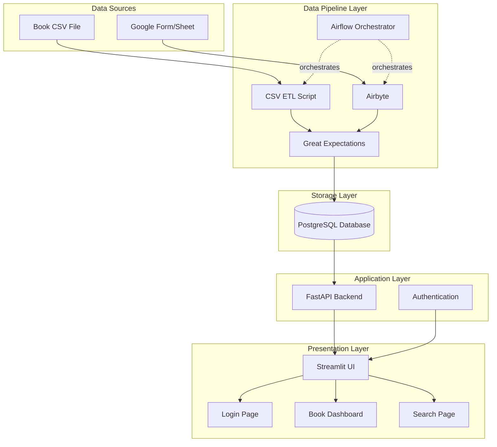

# School Book Management System - Project Plan

A comprehensive Docker-based system for managing school library books with PostgreSQL database, Streamlit UI, and automated data pipelines.

## User Review Required

> [!IMPORTANT]
> **Google Form Design - Revised Approach**
> Instead of dynamic dropdowns for books, the form will use:
> 1. **Category Dropdown**: Fixed list of 3 categories (e.g., A, B, C)
> 2. **Manual Label Input**: Teacher types the numeric portion (e.g., "018")
> 3. **Combined Book ID**: System combines category + label to create book_id (e.g., "A-018")
> 
> This approach eliminates the need for dynamic dropdowns while still allowing precise book identification.


> [!WARNING]
> **Schema Changes**: The database will use Alembic migrations to handle schema changes. This requires running migration commands when schema updates are needed.

## Project Architecture



---

## Technology Stack

### Core Infrastructure
- **Containerization**: Docker & Docker Compose
- **Database**: PostgreSQL 15+
- **Migration Tool**: Alembic

### Data Pipeline
- **ETL Framework**: Python (Pandas, SQLAlchemy)
- **Data Integration**: Airbyte (for Google Sheets)
- **Orchestration**: Apache Airflow
- **Data Quality**: Great Expectations

### Application Layer
- **Backend API**: FastAPI (REST API)
- **Frontend**: Streamlit
- **Authentication**: JWT tokens with bcrypt
- **ORM**: SQLAlchemy

### Development Tools
- **Language**: Python 3.13
- **Package Management**: pip + requirements.txt
- **Environment**: python-dotenv
- **Version Control**: Git

---

## Database Design

### Schema Overview

#### Table: `teachers`
```sql
CREATE TABLE teachers (
    teacher_id SERIAL PRIMARY KEY,
    name VARCHAR(100) NOT NULL,
    classroom VARCHAR(50),
    created_at TIMESTAMP DEFAULT CURRENT_TIMESTAMP
);
```

#### Table: `categories`
```sql
CREATE TABLE categories (
    category_id SERIAL PRIMARY KEY,
    category_name VARCHAR(100) NOT NULL,
    category_label VARCHAR(50) NOT NULL UNIQUE,
    created_at TIMESTAMP DEFAULT CURRENT_TIMESTAMP
);
```

#### Table: `locations`
```sql
CREATE TABLE locations (
    location_id SERIAL PRIMARY KEY,
    category_label VARCHAR(50),
    location_name VARCHAR(100) NOT NULL,
    created_at TIMESTAMP DEFAULT CURRENT_TIMESTAMP,
    FOREIGN KEY (category_label) REFERENCES categories(category_label)
);
```

#### Table: `books`
```sql
CREATE TABLE books (
    book_id VARCHAR(50) PRIMARY KEY,
    name VARCHAR(255) NOT NULL,
    category_id INTEGER,
    storage_location_id INTEGER,
    status VARCHAR(20) DEFAULT 'Available',
    created_at TIMESTAMP DEFAULT CURRENT_TIMESTAMP,
    updated_at TIMESTAMP DEFAULT CURRENT_TIMESTAMP,
    FOREIGN KEY (category_id) REFERENCES categories(category_id),
    FOREIGN KEY (storage_location_id) REFERENCES locations(location_id),
    CHECK (status IN ('Available', 'On Loan', 'Lost', 'Archived'))
);
```

#### Table: `transactions`
```sql
CREATE TABLE transactions (
    transaction_id SERIAL PRIMARY KEY,
    book_id VARCHAR(50) NOT NULL,
    teacher_id INTEGER NOT NULL,
    action VARCHAR(10) NOT NULL,
    transaction_date DATE NOT NULL,
    timestamp TIMESTAMP DEFAULT CURRENT_TIMESTAMP,
    notes TEXT,
    FOREIGN KEY (book_id) REFERENCES books(book_id),
    FOREIGN KEY (teacher_id) REFERENCES teachers(teacher_id),
    CHECK (action IN ('borrow', 'return'))
);
```

#### Table: `users` (for authentication)
```sql
CREATE TABLE users (
    user_id SERIAL PRIMARY KEY,
    username VARCHAR(50) UNIQUE NOT NULL,
    password_hash VARCHAR(255) NOT NULL,
    role VARCHAR(20) DEFAULT 'user',
    created_at TIMESTAMP DEFAULT CURRENT_TIMESTAMP,
    CHECK (role IN ('admin', 'user'))
);
```

---

## ETL Pipeline Strategy

### Pipeline 1: CSV Book Data Import

**Purpose**: Initial and periodic bulk loading of book inventory

**Process**:
1. **Extract**: Read CSV file with columns: `category_name`, `category_label`, `book_name`, `location`
2. **Transform**:
   - Validate required fields
   - Normalize category and location names
   - Generate book IDs if not present
   - Check for duplicates
3. **Load**:
   - Insert/update categories (upsert)
   - Insert/update locations (upsert)
   - Insert books (skip duplicates or update)
4. **Quality Checks**: Great Expectations validations

**Tools**: Python script with Pandas, triggered by Airflow

---

### Pipeline 2: Google Sheets Transaction Sync

**Purpose**: Continuous sync of borrow/return transactions

**Process**:
1. **Extract**: Airbyte pulls data from Google Sheets
   - Columns: `teacher_name`, `category`, `category_label_partial`, `action_type`, `timestamp`, `date`
2. **Transform**:
   - Combine `category` + `category_label_partial` to create `book_id` (e.g., "A" + "018" = "A-018")
   - Match teacher names to `teacher_id` (fuzzy matching if needed)
   - Validate action type (borrow/return)
   - Use `timestamp` for auto-generated entries, `date` for manual entries
   - **Deduplication**: Keep latest record per book based on timestamp
   - Validate that `book_id` exists in the books table
3. **Load**:
   - Insert new transactions
   - Update book status based on latest action
4. **Quality Checks**: Validate referential integrity

**Tools**: Airbyte → Staging table → Python transformation → Production tables

**Sync Strategy**: 
- Incremental sync based on timestamp
- Run every 15-30 minutes via Airflow
- Handle conflicts by taking the latest timestamp

---

## Implementation Phases

### Phase 1: Foundation (Week 1)
**Goal**: Set up development environment and project structure

**Deliverables**:
- Project directory structure
- Docker Compose configuration
- PostgreSQL database container
- Git repository with .gitignore
- Environment configuration (.env template)
- Database initialization scripts

---

### Phase 2: Database Layer (Week 1-2)
**Goal**: Implement database schema with migration support

**Deliverables**:
- Alembic migration setup
- Initial schema migration
- Seed data for testing
- Database connection utilities

---

### Phase 3: CSV ETL Pipeline (Week 2)
**Goal**: Enable initial book data loading

**Deliverables**:
- CSV parser and validator
- Data transformation logic
- Great Expectations suite for CSV data
- Airflow DAG for CSV import
- Documentation for running imports

---

### Phase 4: Backend API (Week 2-3)
**Goal**: Create REST API for all operations

**Deliverables**:
- FastAPI application structure
- Authentication endpoints (login, token refresh)
- CRUD endpoints for all entities
- Business logic for transactions
- API documentation (Swagger)

---

### Phase 5: Streamlit UI (Week 3-4)
**Goal**: Build user interface

**Deliverables**:
- Login page with session management
- Dashboard showing book inventory
- Search functionality by book ID
- Transaction history view
- CSV export feature
- Admin panel for data management

---

### Phase 6: Google Sheets Pipeline (Week 4)
**Goal**: Automate transaction data ingestion

**Deliverables**:
- Airbyte connection to Google Sheets
- Transformation scripts
- Deduplication logic
- Airflow DAG for orchestration
- Great Expectations validations
- Monitoring and alerts

---

### Phase 7: Testing & Documentation (Week 5)
**Goal**: Ensure reliability and maintainability

**Deliverables**:
- Unit tests for critical functions
- Integration tests for pipelines
- End-to-end testing
- User documentation
- Deployment guide
- Troubleshooting guide

---

## Proposed Changes

### Project Structure

#### [NEW] Project Root Directory
```
library_system/
├── .env.example              # Environment template
├── .gitignore               # Git ignore rules
├── docker-compose.yml       # Multi-container orchestration
├── README.md                # Project documentation
├── requirements.txt         # Python dependencies
│
├── backend/                 # FastAPI application
│   ├── Dockerfile
│   ├── app/
│   │   ├── __init__.py
│   │   ├── main.py         # FastAPI entry point
│   │   ├── config.py       # Configuration
│   │   ├── database.py     # Database connection
│   │   ├── models/         # SQLAlchemy models
│   │   ├── schemas/        # Pydantic schemas
│   │   ├── routers/        # API endpoints
│   │   ├── auth/           # Authentication logic
│   │   └── utils/          # Utilities
│   └── requirements.txt
│
├── frontend/                # Streamlit application
│   ├── Dockerfile
│   ├── app.py              # Main Streamlit app
│   ├── pages/              # Multi-page app
│   │   ├── 1_dashboard.py
│   │   ├── 2_search.py
│   │   └── 3_admin.py
│   ├── components/         # Reusable components
│   └── requirements.txt
│
├── database/                # Database setup
│   ├── Dockerfile
│   ├── init/               # Initialization scripts
│   │   └── 01_init.sql
│   └── migrations/         # Alembic migrations
│       ├── alembic.ini
│       ├── env.py
│       └── versions/
│
├── etl/                     # Data pipeline
│   ├── Dockerfile
│   ├── csv_loader/
│   │   ├── load_books.py
│   │   └── validate.py
│   ├── google_sheets/
│   │   ├── transform.py
│   │   └── sync.py
│   ├── great_expectations/
│   │   └── expectations/
│   └── requirements.txt
│
├── airflow/                 # Orchestration
│   ├── Dockerfile
│   ├── dags/
│   │   ├── csv_import_dag.py
│   │   └── sheets_sync_dag.py
│   ├── plugins/
│   └── airflow.cfg
│
└── airbyte/                 # Data integration
    └── connections/         # Connection configs
```

---

## Verification Plan

### Automated Tests

1. **Database Tests**
   ```bash
   pytest tests/test_database.py
   ```
   - Schema creation
   - Foreign key constraints
   - Data integrity

2. **ETL Tests**
   ```bash
   pytest tests/test_etl.py
   ```
   - CSV parsing
   - Data transformation
   - Deduplication logic

3. **API Tests**
   ```bash
   pytest tests/test_api.py
   ```
   - Authentication
   - CRUD operations
   - Business logic

4. **Great Expectations**
   ```bash
   great_expectations checkpoint run books_checkpoint
   ```

### Manual Verification

1. **Docker Deployment**
   - Verify all containers start successfully
   - Check inter-container networking
   - Validate environment variables

2. **UI Testing**
   - Login functionality
   - Dashboard displays correct data
   - Search returns accurate results
   - CSV export works correctly

3. **Data Pipeline**
   - CSV import loads data correctly
   - Google Sheets sync captures new records
   - Deduplication works as expected
   - Airflow DAGs run on schedule

4. **End-to-End Flow**
   - Load initial book data via CSV
   - Submit transaction via Google Form
   - Verify transaction appears in database
   - Check book status updates
   - Confirm UI reflects changes
